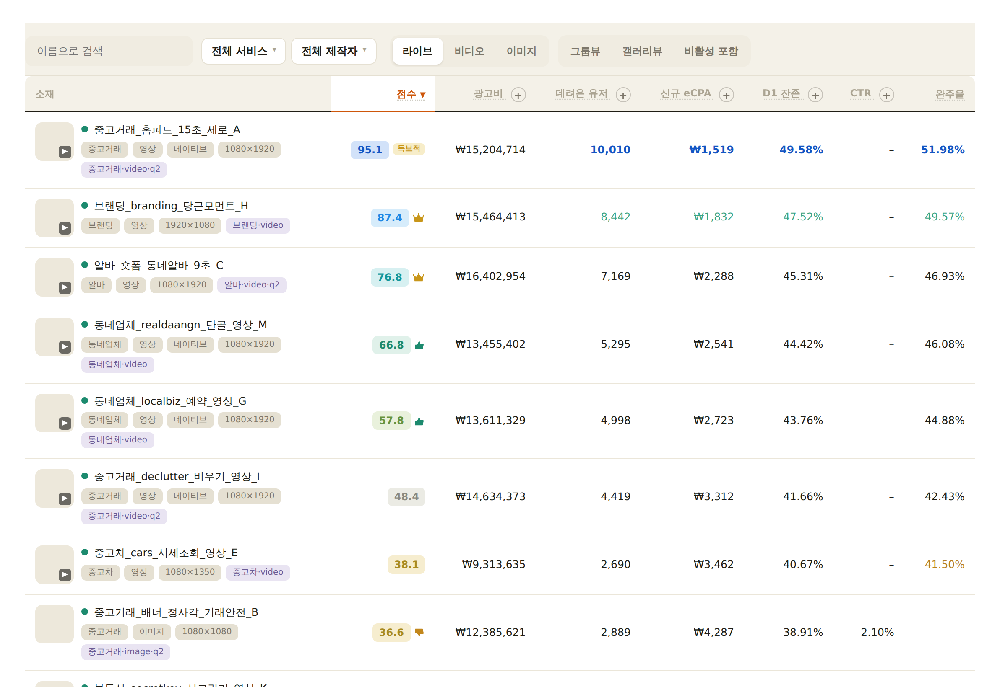
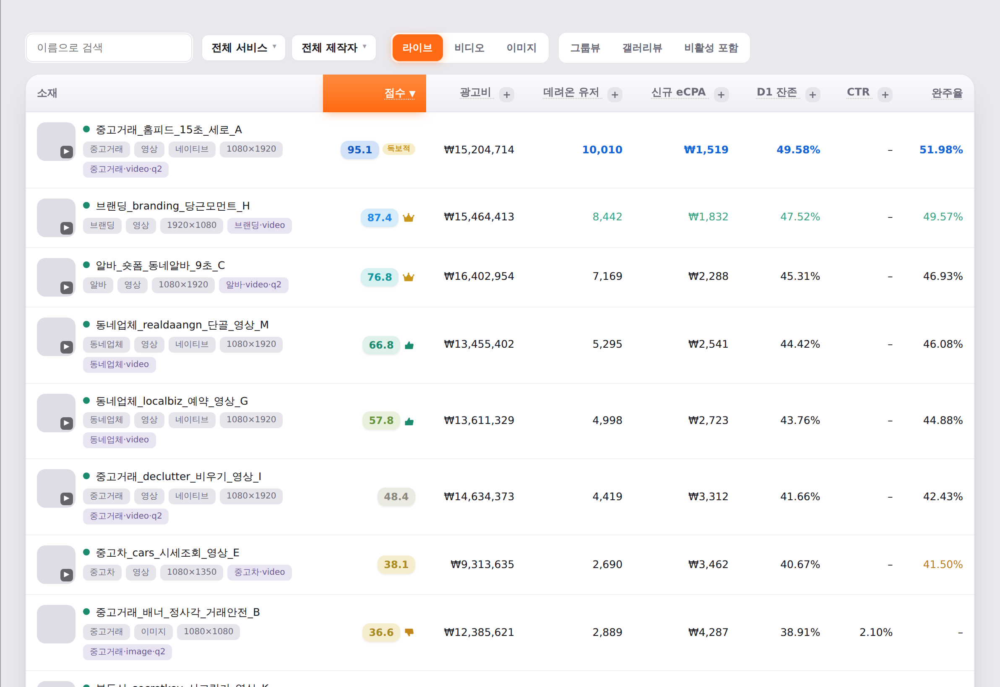

# CreativeReporter

퍼포먼스 소재 성과분석 대시보드입니다. 
https://hansy-daangn.github.io/CreativeReporter/

## 🎨 UI 개선 시안 (2가지 방향)

`frontend-design` · `web-design-guidelines` 가이드로 사이트 UI를 개선한 **두 가지 방향**입니다.
각 링크는 **비밀번호 없이 합성 샘플 데이터로 바로 미리보기**되며, 화면 하단 바에서 **A ↔ B를 즉시 전환**해 비교할 수 있습니다.

| | 시안 A · 편집형 리포트 | 시안 B · 대시보드 콘솔 |
|---|---|---|
| |  |  |
| 성격 | 차분히 **'읽는'** 계기 — 따뜻한 종이 캔버스, 밝은 파치먼트 사이드바, 헤어라인 원장(ledger) 표, 강한 타이포 위계. 오렌지는 정렬된 열·핵심 수치에만 절제해서. | **'조종하는'** 콕핏 — 리치 다크 레일, 떠 있는 카드 표면, 큰 라운드·깊이, 채워진 오렌지 정렬 헤더와 생생한 티어 컬러. |
| 열기 | **[시안 A 미리보기 →](https://hansy-daangn.github.io/CreativeReporter/proposals/a-editorial.html)** | **[시안 B 미리보기 →](https://hansy-daangn.github.io/CreativeReporter/proposals/b-console.html)** |

> 링크는 `main`에 병합되면 GitHub Pages에서 바로 열립니다. PR 브랜치에서 먼저 보려면 저장소를 받아 `proposals/a-editorial.html` · `proposals/b-console.html`을 브라우저로 열면 됩니다.

**두 시안 공통 — 구조·기능 개선** (`index.html` 본 사이트에도 반영)
- 표 툴바 2번째 줄의 **등급 범례(왕관·독보적·따봉…) 제거** — 뱃지 자체로 자명하고, 상세는 분석 탭 '점수 읽는 법'에 있음.
- **표 툴바 2번째 줄을 등급 범례 대신 표 제목행(소재·점수·광고비·데려온 유저…)이 차지** — 클릭 정렬·`+` 세부지표 펼치기는 그대로. 제목행은 `position:sticky; top:0`로 표(가로 스크롤 컨테이너) 상단에 밀착하는 **표준 구조**라, 어떤 창 크기에서도 툴바와 어긋나거나 본문이 가로로 넘치지 않음.
- 정렬 상태 강조, 키보드 조작(Enter/Space)·`aria-sort`·`focus-visible` 등 접근성 보강.

*시안 페이지는 `proposals/`의 테마 CSS(`theme-*.css`) + 데모 부트스트랩을 `node proposals/build.mjs`로 본 앱에 주입해 생성합니다.*

- **[docs/ARCHITECTURE.md](docs/ARCHITECTURE.md)** — 사이트 구조와 매커니즘 상세 설명
- **[docs/REBUILD_PROMPT.md](docs/REBUILD_PROMPT.md)** — 무에서 동일 시스템을 재구축하는 완전제작 프롬프트

## 사용법

- 첫 화면에서 비밀번호 입력 → 클라우드(Supabase)에 쌓인 주간 성과 로드
- 파일명이 `meta_` · `moloco_` · `google_` 로 시작하는 **주간** 리포트만 저장소에 누적 (월간·일간·매체 미상은 임시 분석만)

## 지원 리포트

- **Moloco 크리에이티브 리포트** — `creative_preview`·`creative_type` 자동 감지, 이미지/영상 미리보기
- **Google Ads 확장 소재 연결 보고서** — `주` 컬럼 주간 리포트, ROAS·전환 지표
- **일반 ad_name CSV(메타 등)** — `thumbnail_url`·`image_url`·`creative_preview`·`미리보기` 컬럼이 있으면 썸네일 자동 연동
- **구글 이름 매핑 CSV** — `광고그룹 ID`+`광고그룹`(또는 캠페인 쌍, `항목 ID`+`애셋` 쌍) 컬럼이 있는 파일을 드롭하면 ID/URL 대신 실제 이름 표시 (클라우드에 누적 저장)
  - 내보내기: Google Ads → 보고서 편집기에서 위 열만 담아 CSV 다운로드 → 그대로 드롭
- **구글 광고그룹 보고서** — 드롭하면 그룹 이름·캠페인·상태(운영/일시중지/정책 제한)·타겟 CPA·누적 성과·영상 재생 퍼널을 광고그룹 ID 기준으로 저장, 그룹별 보기와 그룹 상세에 표시
  - 이미 저장된 정보와 달라지는 항목이 있으면 업데이트 여부를 확인창으로 물어봄 (신규 항목뿐이면 바로 반영)
- **이미지 소재 OCR 이름** — 이름이 URL뿐인 구글 이미지 애셋은 이미지 속 텍스트를 추출해 표시(`OCR` 마크 부착, 공식 애셋 이름 등록 시 자동 대체). 별도 저장소(kv `ocr`)라 통째 삭제로 즉시 취소 가능
- 매체 판별 우선순위: 리포트 형식 자동 감지 → 미리보기 URL 도메인 → 드롭존 → 파일명
