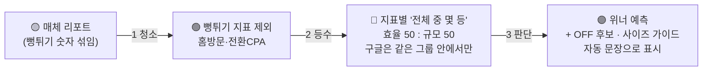

# 회의 → 실행 전수 대조 리포트 (누구나 읽는 버전)

> **한 줄 결론: 2026-07-14 회의에서 나온 개선 항목 26개를 전부 처리했다.**
> 코드·DB로 해결 **22** · 원칙 문구로 반영 **1** · 사람 확인만 남음 **3** (Jace·Marin 컨펌, 노션 배포)
> 결과물: PR [#122](https://github.com/hansy-daangn/CreativeReporter/pull/122) · 사이트 https://hansy-daangn.github.io/CreativeReporter/
> ※ 26번째 항목은 회의록을 다시 읽다가 **추가로 발굴**한 것("'매우 좋음' 등급 믿지 말기").

## 0. 바뀐 것 한 장 요약

| | 예전 | 지금 |
|---|---|---|
| 믿는 숫자 | 홈방문·전환 포함(부풀려짐) | 부풀려진 지표는 점수에서 제외(표엔 '참고') |
| 점수 계산 | 여러 지표를 복잡한 비율·가중치로 | 지표별 **등수**(전교 등수처럼) → 효율 반 + 규모 반 |
| 구글 | 모든 소재를 한 줄로 비교 | **같은 광고그룹 안에서만** 등수 (그룹뷰 기본) |
| 기간 | 최근 1달/3달/전체만 | + **월별 보기** · 날짜 직접 입력 |

## 1. "이 숫자를 믿어도 되나?" — 지표 신뢰 (회의 전반부)

| 회의에서 나온 말 | 확인해 보니 (데이터) | 한 일 | 그래서 |
|---|---|---|---|
| "홈 방문은 과집계라 빼는 게 맞다" — 유저가 내일도 모레도 들어오면 다 집계됨 | 실제 신규 유저 수의 **약 427배**로 부풀어 있었음 | 홈 방문·홈 단가를 점수에서 제외, 표에는 '참고'로 남기고 이유를 툴팁에 적음 | 짐작이 아니라 **실측으로 확정** — "빼자"는 판단이 옳았음 |
| "ACE 전환 CPA는 완전 과집계" | 전환 수가 **약 565배** 부풀림 | ACE 점수에서 전환 CPA·전환율 제외 → 노출+CPM으로 교체 | ACE는 "그룹 안 상대평가만 가능"이라는 회의 결론 그대로 구현 |
| "제목(headline)이 기여를 다 먹어서 어떤 영상 덕인지 알 수 없다" | 소재별 유저 집계가 실제의 36~94%만 잡힘(제목이 가져감) | 텍스트 애셋은 원래 집계 제외였음을 확인하고 문서에 명문화 | 구글 소재별 '유저 수'는 못 믿는다 → 그룹 단위로 우회(3장) |
| "구글 '매우 좋음' 등급은 반응 퀄일 뿐" (부동산 2509: 다 90점대인데 유입 적음) | 등급은 채점에 안 쓰고 있었음(보관만) | 앞으로도 안 쓴다고 화면 설명·가이드에 못 박음 | **회의록 재검토로 찾은 26번째 항목** |
| "활성유저를 규모로 보면 안 됨" | 신규+재활성의 **11.6배** 부풀림 | 규모 = **신규+재활성 유저(AUU)** 로 통일 | '데려온 유저'의 기준이 하나로 정리됨 |
| "설치 단가(CPI)가 아니라 유입 유저당 단가로" — 재설치 유저는 CPI에 안 잡힘 | — | 효율 = **신규+재활성 eCPA**(유저 1명 데려오는 데 든 돈)로 통일 | 몰로코·메타·문서·툴팁 전부 같은 정의 사용 |

## 2. "점수를 어떻게 매길까" — 채점 방식 (회의 중반)

| 회의에서 나온 말 | 한 일 | 그래서 |
|---|---|---|
| "광고비면 광고비끼리 '전체에서 몇 등', 노출이면 노출끼리 몇 등 — 등수로 채점하자" | 나누기 공식 대신 **지표별 등수**로 전환 (소재 1개=1표) | 자동 검증 통과 — 같은 성과면 광고비가 커도 작아도 같은 등수 |
| "효율 반, 규모 반" (합 100) | 점수 = 효율 등수 50% + 규모 등수 50% | 예전(효율 85 : 규모 15)보다 "많이 데려왔는가"가 절반 비중으로 승격 |
| "이미지가 노출 절대량 때문에 점수 손해 보면 안 된다" | 절대량이 아닌 등수(상대 위치)라 구조적으로 해소 | 노출 10만 vs 100만이라도 각자 위치로만 비교됨 |
| "비디오·이미지 나눠서 채점? → 아니, 같이 봐야" | 구글은 포맷 구분 없이 그룹 안에서 함께 등수 | 회의 결론 그대로 |
| "광고비가 짱 — 잘 나가는 소재에 머신러닝이 예산을 몰아줌. 단, 비용 높은데 단가도 나쁘면 꺼야" | 분석 탭 '자동 해석'에 상시 표시: 광고비 1위가 단가 양호→**위너 후보**, 단가 나쁨→**OFF 후보** | 매주 눈으로 안 찾아도 자동으로 경고 |

## 3. "구글은 그룹으로" — 매체별 기준 (회의 핵심 결론)

| 매체 | 회의 결론 | 반영 |
|---|---|---|
| 구글 AEO(앱설치) | 신규 단가 + 노출량 반반 | ✅ 그대로 |
| 구글 ACE(리타게팅) | 노출수 + CPM 반반, 그룹 안 상대평가만 | ✅ 그대로 (영상 조회수는 안 봄 — 회의) |
| 몰로코 | eCPA + 규모 반반, 그룹뷰 불필요 | ✅ 그대로 |
| 메타 | "몰로코랑 똑같이" | ✅ 그대로 (Marin 정리본과 최종 대조 예정) |

- **왜 그룹 안에서만?** 잘나가는 그룹에선 1등이 노출을 독식해 2~5등이 가려지고, 약한 그룹의 1등은 과대평가됨(회의 그대로). → 구글 소재 점수 = **자기 그룹 안 등수**, 그룹끼리 비교는 **그룹 행 점수**가 담당.
- 구글을 열면 그룹뷰가 기본으로 켜짐. 그룹에 소재가 혼자면 비교 불가 → 중립(50점 취급)으로 두고 다른 그룹과 섞지 않음.
- 매체끼리 점수 비교는 금지 — 유저 1명 단가가 매체 간 40~80배 차이(구글 ₩30 / 몰로코 ₩684 / 메타 ₩2,365).

## 4. 화면·사용법 (회의 후반 요청)

| 회의에서 나온 말 | 한 일 |
|---|---|
| "기간을 직접 설정하고 싶다 — 지금은 오늘 기준으로만" | 기간 → 직접 설정에 **날짜 범위(시작~끝)** 입력 추가 |
| "1~6월, '6월엔 누가 승리했나'가 보고 싶다" | **월별 보기** 추가 — 달을 고르면 그 달의 승자(표)와 월내 흐름(추세)이 함께 나옴 |
| "저걸 누르면 라이브 소재가 뜨는군요" (유지 요청) | 소재→미리보기 연결 전수 점검 — 14/14 정상 |
| "몰로코는 사이즈마다 완전 달라 — 이미지만 5만 원씩" | 사이즈별 단가가 평균의 1.5배 넘으면 '**끌 지면·만들지 말 소재 후보**'로 자동 표시 |
| "크리테오가 열리면 구글 지표는 안 떨어져 보인다(카니발라이제이션)" | 매체 지표 단독 신뢰 금지 + BigQuery 교차확인 안내를 화면 설명에 고정 (앱에 크리테오 데이터가 없어 자동 태그는 불가 → 문구로) |

## 5. 사람이 확인할 것 (3건)

| 무엇 | 누구 | 왜 |
|---|---|---|
| 구글 CPA의 진짜 소스 = BigQuery 광고그룹 CPA 맞는지 | **Jace** | 회의에서 "한 번 더 물어보자"로 남음 |
| 메타 채점 기준이 정리본과 맞는지 | **Marin** | 방향(eCPA·신규재활성 중심)은 일치 확인, 최종 컨펌만 |
| 채점 가이드 노션 배포 | **Hansy** | 원고는 `docs/SCORING_GUIDE.md`에 완성해 둠 |

## 6. 부족했던 점 · 더 해봤으면 좋았을 것 (솔직하게)

- **그룹뷰의 표시 숫자는 여전히 소재 합산** — 구글 '글자 애셋' 실적이 빠져 실제 그룹 성과보다 작게 보임. 열려 있는 PR #121(실측 CSV로 교체)이 이걸 보완 — 머지 순서에 따라 조정 필요.
- **몰로코 사이즈 가이드의 기준(1.5배)은 초기값** — 몇 주 데이터로 "이 기준이면 진짜 끌 만한 것만 걸리나" 재확인 권장.
- **채점 설정을 이미 커스텀한 기기**는 새 기본(50:50)이 자동 적용되지 않음 — ⚙ 채점 설정에서 초기화 필요(기본을 안 만진 기기는 자동 적용).
- **월별 보기는 '주 시작일(월요일)' 기준** — 월 경계에 걸친 주는 시작일이 속한 달로 들어감(주간 데이터의 한계).
- **BigQuery 자동 연동은 없음** — 교차검증은 이번처럼 수동. 자동화하려면 별도 파이프라인 필요(다음 과제 후보).
- **구글에는 D1/D7 잔존 데이터가 없음** — 보조지표(잔존)는 몰로코·메타에서만 보임.

## 7. 해보고 얻은 깨달음

1. **"과집계 같다"는 감이 전부 실측으로 확정됨** — 홈방문 427배, 전환 565배, 활성유저 11.6배. 감으로 빼는 것과 숫자로 빼는 것은 설득력이 다름.
2. **DB에 뷰를 만들자 보안 구멍이 드러남** — Supabase는 새로 만든 뷰에 외부 접근 권한을 자동으로 부여함. 그대로 뒀으면 **비밀번호 없이 전체 성과 데이터가 열릴 뻔** → 잠금 처리(migration에 포함). "추가만 하는 작업도 보안 확인이 필요하다"가 교훈.
3. **등수화가 이미지 불이익을 실제로 없앰** — 자동 테스트로 "광고비가 달라도 같은 성과=같은 등수", "그룹이 다르면 서로 영향 없음"을 수치로 확인.
4. **혼자 있는 그룹은 '중립'이 정직** — 비교 대상이 없는 소재에 점수를 만들어 주는 것보다 50점 중립이 회의 원칙(그룹 혼합 금지)에 맞음.
5. **문서와 화면 설명은 코드와 함께 고쳐야 함** — 점수 공식이 바뀌면 푸터·툴팁·가이드가 전부 옛말이 됨. 이번에 한 번에 동기화.

## 8. 어디서 확인?

- 사이트: https://hansy-daangn.github.io/CreativeReporter/ (하단 '점수 읽는 법'이 새 기준)
- PR: https://github.com/hansy-daangn/CreativeReporter/pull/122 · 팀 가이드 원고: `docs/SCORING_GUIDE.md`
- 근거 노트(옵시디언): 00 회의록 교정본 v2 · 02 P2 교차검증 · 03 결정 로그(+03-1 추가분) · 04 실행 결과 보고
