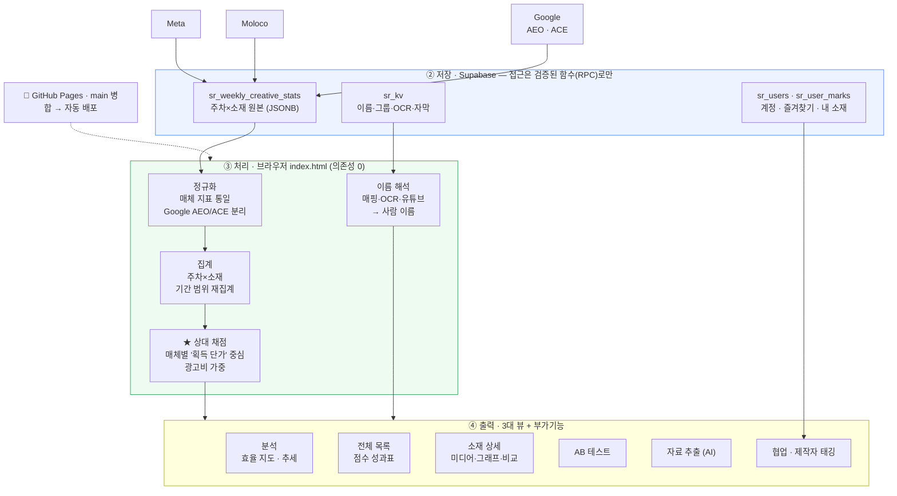
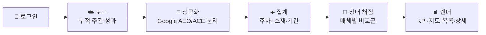
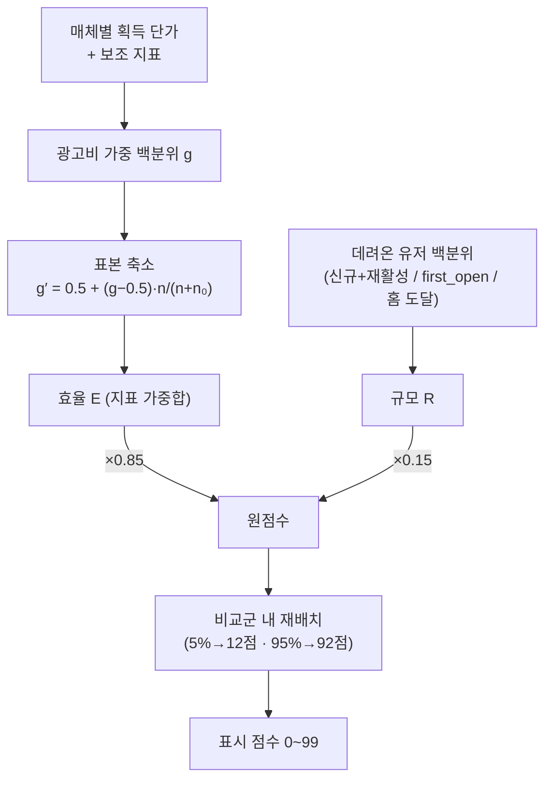

# 당근 소재분석툴 — 발표 마스터

> 발표 슬라이드를 만들기 위한 **콘텐츠 원본**입니다. 현재 운영 중인 「당근 소재분석툴」의 목적·구조·기능을 슬라이드 단위로 정리했습니다.
>
> **읽는 법** — 각 슬라이드는 두 블록으로 구성됩니다.
> - `⬛ 슬라이드` = 화면에 **큰 글씨**로 올릴 두괄식 개조식 문장 (+ 도식 지시). 슬라이드엔 이만 띄웁니다.
> - `🎤 발표 대본` = 슬라이드 **아래에서 말로 푸는** 줄글 설명. 화면엔 넣지 않습니다.
>
> **작성 원칙**: 두괄식 · 개조식 · 현재 상태만. 도입 이력·과거 방식은 다루지 않습니다.

---

# Part 0. 발표 설계

## 한 줄 정의

> **여러 매체에 흩어진 소재 성과를 한 곳에 모아, "신규·복귀 유저를 얼마나 효율적으로 데려왔는가"라는 하나의 잣대로 자동 채점·비교하는 웹 대시보드.**

## 이 툴이 답하는 질문

> **"이번 주, 어떤 소재가 당근에 신규·복귀 유저를 가장 싸게 데려왔는가?"**

## 청중 · 목적 · 톤

| 항목 | 내용 |
|---|---|
| **청중** | 마케터 · 디자이너 (실무 경력 보유, 기술 용어 이해도는 낮음) |
| **목적** | 이 툴이 **무엇을·왜·어떻게** 하는지 이해시켜 신뢰 확보 — 소재분석 도구로서의 쇼케이스 |
| **톤** | 전문적 · 간결. 유치한 비유·장난기 없음 |
| **깊이 전략** | 슬라이드엔 결론만 크게. 상세·공식은 발표 대본과 부록으로 분리 |

## 슬라이드 맵

```mermaid
flowchart LR
    A["1 표지"] --> B["2 문제<br/>Why"]
    B --> C["3 한 장 요약<br/>What"]
    C --> D["4 전체 아키텍처 ★<br/>MECE 한 장"]
    D --> E["5 데이터<br/>파이프라인"]
    E --> F["6 지원 매체<br/>Google 분리"]
    F --> G["7 화면 구조<br/>3대 뷰"]
    G --> H["8 효율 지도<br/>· 추세"]
    H --> I["9 전체 목록"]
    I --> J["10 소재 상세"]
    J --> K["11 채점 시스템 ★★<br/>획득 단가"]
    K --> L["12 AB 테스트"]
    L --> M["13 이름 시스템"]
    M --> N["14 자료 추출<br/>AI 연계"]
    N --> O["15 협업"]
    O --> P["16 마무리"]
```



- **도입(1–3)**: 무엇을·왜 — 목적을 못 박는다.
- **뼈대(4–7)**: 한 장 아키텍처 → 데이터 → 매체 → 화면.
- **기능(8–15)**: 실제 화면. **11번 채점이 최대 차별점**.
- **닫기(16)**: 요약·차별점.

> **분량 원칙**: 슬라이드 4(아키텍처)와 11(채점)은 각각 **한 장 풀로** 쓴다. 나머지는 헤드라인 + 개조식 4~6줄로 압축.

---

# Part 1. 슬라이드

## 슬라이드 1 — 표지

### ⬛ 슬라이드

**당근 소재분석툴**

- 매체를 넘나드는 소재 성과, **하나의 기준으로** 본다
- Meta · Moloco · Google 주간 소재 성과 → 자동 채점 · 비교
- 웹 대시보드 · 로그인형

📊 **도식**: 실제 대시보드 스크린샷 1장(전체 목록 또는 효율 지도)에 제품명 오버레이. 당근 브랜드 주황 악센트.

### 🎤 발표 대본

당근 소재분석툴입니다. 퍼포먼스 광고에서 우리가 만든 소재가 실제로 얼마나 성과를 냈는지 — 그중에서도 **신규·복귀 유저를 효율적으로 데려온 소재가 무엇인지**를 매체를 가리지 않고 한 화면에서 보는 도구입니다. 오늘은 이 툴이 어떤 문제를 풀고, 어떻게 설계됐고, 무엇을 할 수 있는지 순서대로 보여드리겠습니다.

---

## 슬라이드 2 — 문제 (Why)

### ⬛ 슬라이드

**매체마다 지표·기준·이름이 달라서, "어떤 소재가 잘했나"를 한눈에 판단할 수 없었다.**

- **파편화** — Meta·Moloco·Google이 각자 다른 지표·포맷으로 성과를 보고 → 나란히 비교 불가
- **기준 부재** — CTR 3%는 좋은 건가? **절대 수치만으론 우열 판단 불가**
- **식별 난해** — 소재 이름이 URL·숫자 ID로만 남아 사람이 못 알아봄
- **목적 실종** — 정작 궁금한 "신규·복귀 유저를 싸게 데려왔나"는 리포트 어디에도 정리돼 있지 않음

📊 **도식**: 좌측 "제각각인 3개 리포트" → 우측 "점수순으로 정렬된 하나의 표"로 수렴하는 Before/After.

### 🎤 발표 대본

문제는 세 겹입니다. 첫째, 매체마다 지표 체계가 다릅니다 — Meta엔 Meta의 지표, Moloco엔 Moloco의 지표가 있어서 그대로는 비교가 안 됩니다. 둘째, 절대 수치만으론 판단이 안 됩니다. CTR 3%가 좋은 건지 나쁜 건지는 **다른 소재와 견줘봐야** 압니다. 셋째, 소재 이름이 URL이나 ID로만 남아 사람이 식별하기 어렵습니다. 그리고 무엇보다 — 우리가 진짜 알고 싶은 건 "이 소재가 신규·복귀 유저를 얼마나 싸게 데려왔나"인데, 그 관점으로 정리된 화면이 없었습니다. 이 툴은 그 판단을 자동화합니다.

---

## 슬라이드 3 — 한 장 요약 (What)

### ⬛ 슬라이드

**흩어진 소재 성과 → 하나의 점수 → 바로 비교.**

- **입력**: Meta · Moloco · Google의 **주간** 소재 성과
- **처리**: 매체별 정규화 → **획득 단가 중심 상대 채점**(광고비 가중) → 등급·순위 자동
- **출력**: 점수·추세·포지셔닝 / 효율 지도 / AB 비교 / AI용 리포트
- **형태**: 외부 라이브러리 **0개**, 모든 계산을 브라우저에서 하는 경량 단일 페이지

📊 **도식**: `입력(3매체) → [소재분석툴] → 출력(점수·차트·리포트)` 3단 블록. 매체 아이콘 3종.

### 🎤 발표 대본

한 장으로 요약하면 이렇습니다. 세 매체의 주간 소재 성과를 입력받아, 매체별로 지표를 정규화한 뒤, "얼마나 효율적으로 유저를 데려왔나"를 기준으로 상대 채점합니다. 결과는 소재별 점수와 추세, 효율 지도, AB 비교, 그리고 AI에 바로 붙일 수 있는 리포트로 나옵니다. 기술적으로는 프레임워크 없이 HTML 파일 하나로 돌아가고, 집계와 채점을 전부 브라우저 안에서 계산합니다.

---

## 슬라이드 4 — 전체 아키텍처 ★ (한 장)

### ⬛ 슬라이드

**입력 → 저장 → 브라우저 처리 → 출력. 프레임워크 없는 4단 파이프라인.**

📊 **도식 (이 한 장을 풀로 사용)**:



### 🎤 발표 대본

전체 구조는 네 단계입니다. **① 입력** — 세 매체의 주간 소재 성과가 들어옵니다. **② 저장** — Supabase(클라우드 DB)에 세 종류로 나눠 쌓입니다: 성과 원본, 이름·그룹·OCR 같은 보조 정보, 그리고 계정·마크. 모든 접근은 검증된 함수를 통해서만 이뤄져 안전합니다(이 부분은 필요하면 Q&A에서). **③ 처리** — 여기가 핵심인데, 무거운 서버 없이 **브라우저 안에서** 정규화·집계·채점·이름 해석을 전부 계산합니다. 의존성이 0이라 가볍고 이식성이 높습니다. **④ 출력** — 세 개의 메인 뷰(분석·전체 목록·소재 상세)와 부가 기능(AB 테스트·자료 추출·협업)으로 나옵니다. 배포는 main 브랜치에 합치면 GitHub Pages로 자동으로 나갑니다. 이 다이어그램 하나가 오늘 발표의 목차이기도 합니다.

---

## 슬라이드 5 — 데이터 파이프라인

### ⬛ 슬라이드

**로그인하면, 클라우드에 쌓인 주간 성과가 자동으로 불려와 채점까지 끝난 화면이 뜬다.**

- **로그인** → 권한 판별(뷰어·에디터·관리자)
- **로드** → 누적 주간 성과 **전량**을 한 번에
- **정규화** → 매체 지표 통일 · **Google을 AEO/ACE로 분리**
- **집계** → (주차 × 소재) 합산, 선택 기간·매체로 재집계
- **채점** → 매체별 비교군 안에서 상대 점수·등급
- **렌더** → KPI · 지도 · 목록 · 상세

📊 **도식**:



### 🎤 발표 대본

사용자가 겪는 흐름은 단순합니다. 로그인하면 권한을 판별하고, 클라우드에 쌓인 주간 성과를 전부 한 번에 불러옵니다. 이걸 매체별로 정규화하는데 — 이때 Google은 성과 기준이 다른 두 유형으로 자동으로 쪼갭니다(다음 장에서 설명). 그다음 주차별·소재별로 합산하고, 화면에서 고른 기간과 매체 범위에 맞춰 다시 집계·채점합니다. 마지막으로 요약 KPI, 효율 지도, 목록, 상세를 그립니다. 기간을 바꾸면 데이터를 복제해 그 범위만으로 다시 채점하기 때문에, 언제나 "고른 기간 안에서의 상대 성과"를 봅니다.

---

## 슬라이드 6 — 지원 매체 · Google 분리

### ⬛ 슬라이드

**Meta · Moloco · Google 3매체. 그리고 Google은 성과 기준이 다른 두 유형(AEO·ACE)으로 자동 분리한다.**

- **Meta** — 이미지·영상 소재 (CTR·CPM·완주율)
- **Moloco** — 크리에이티브 리포트 (미리보기·타입·해상도·완주율)
- **Google** → **두 갈래로 분리**:
  - **AEO** (신규·설치 최적화) — 단가 라벨 **CPI** (설치당 비용)
  - **ACE** (리타겟·인앱액션) — 단가 라벨 **CPA** (액션당 비용)
- 두 유형은 성과·단가 기준이 달라 **집계·채점을 독립적으로** 수행

📊 **도식**: 매체 3종 카드. Google 카드는 AEO/ACE 두 갈래로 분기되는 트리. 각 카드에 대표 지표·단가 라벨 배지.

### 🎤 발표 대본

지원 매체는 세 개입니다. Meta와 Moloco는 각자의 리포트가 있고요. Google이 특별한데 — 같은 "Google"이라도 신규 유저를 데려오는 캠페인(AEO)과 이미 온 유저를 다시 부르는 캠페인(ACE)은 목적도, 성과를 봐야 하는 기준도 완전히 다릅니다. 그래서 이 툴은 Google을 하나로 뭉뚱그리지 않고 AEO와 ACE로 갈라서, 각각 별개 매체처럼 따로 집계하고 따로 채점합니다. 단가 라벨도 AEO는 설치당 비용인 CPI, ACE는 액션당 비용인 CPA로 다르게 붙입니다. 어느 유형인지는 소재의 캠페인 이름을 보고 자동으로 판별합니다.

---

## 슬라이드 7 — 화면 구조 (3대 뷰)

### ⬛ 슬라이드

**왼쪽 사이드바(매체·기간·요약) + 오른쪽 본문 3탭. 그게 전부다.**

- **사이드바**: 매체 선택 · 기간(1달/3달/전체/직접) · 요약 KPI(광고비·설치·eCPI·활성·eCPA) · 저장소 현황 · 용어/자료 버튼
- **본문 탭 3종**:
  1. **분석** — 요약 타일 + 효율 지도 + 주차별 추세
  2. **전체 목록** — 점수 성과표
  3. **AB 테스트** — 이름 변형 자동 비교 *(해당 소재 없으면 탭 숨김)*
- **반응형**: 좁은 화면에선 요약 접힘, 미리보기 중심

📊 **도식**: 좌 사이드바 + 우 탭 3개 와이어프레임. 각 영역에 라벨 콜아웃.

### 🎤 발표 대본

화면은 아주 단순합니다. 왼쪽 다크 사이드바에서 볼 매체와 기간을 고르고, 그 조건의 요약 지표를 봅니다. 오른쪽 본문은 세 개 탭입니다 — 소재들의 전체 그림을 보는 '분석', 개별 소재를 점수로 나열하는 '전체 목록', 그리고 같은 소재의 A/B 변형을 비교하는 'AB 테스트'. AB 테스트 탭은 인식된 실험 그룹이 있을 때만 나타납니다. 다음 몇 장에서 이 뷰들을 하나씩 보겠습니다.

---

## 슬라이드 8 — 분석 탭: 효율 지도 · 추세

### ⬛ 슬라이드

**소재를 2축 좌표에 흩뿌려 "어디에 몰려 있고 무엇이 이탈값인가"를 한눈에.**

- **효율 지도** (산점도): 기본 축 = 매체별 "주요하되 성격이 다른 2개" — 세로 **채점 1순위 단가** × 가로 **비율·질 축** (AEO 신규 단가×신규 전환율 · ACE 홈 단가×홈 도달율 · 몰로코/메타 eCPA×D1 잔존율)
  - **보기 전환**: 개별 / 포맷 / 사이즈 / 형태 / 지면 / 서비스별 집계
  - **지도 전용 필터**: Live(집행 중) · Video · Image
  - 점 크기 = 광고비 · 양축 슬라이더로 확대
- **주차별 추세**: 광고비/노출/클릭/설치/활성유저 토글, 광고비 선택 시 단가선 동반
- **요약 타일**: 포맷·사이즈 우위, 주간 흐름 하이라이트

📊 **도식**: 효율 지도 스크린샷 + 축·필터·점크기 의미를 화살표 주석. 우측에 추세 그래프 축소본.

### 🎤 발표 대본

분석 탭의 핵심은 효율 지도입니다. 가로축은 클릭률, 세로축은 획득 단가로 소재들을 뿌려주는데 — 오른쪽 아래로 갈수록 "클릭도 잘 되고 싸게 데려온" 좋은 소재입니다. 개별 소재 대신 포맷별·사이즈별·서비스별로 묶어서 볼 수도 있고, 집행 중인 것만 보거나 영상/이미지만 걸러 볼 수도 있습니다. 점의 크기는 광고비라서, 큰 점일수록 실제로 돈이 많이 들어간 소재입니다. 아래쪽 주차별 추세에서는 광고비·노출·설치 같은 지표가 주 단위로 어떻게 움직였는지 봅니다.

---

## 슬라이드 9 — 전체 목록 (성과표)

### ⬛ 슬라이드

**모든 소재를 점수·핵심 지표로 나열하고, 칩·뱃지·필터로 원하는 것만 좁힌다.**

- **대표 컬럼**: 점수 · **광고비** · eCPI · eCPA · CTR · 완주율 (헤더 `+`로 세부 펼침)
- **점수 색**: 10단계 색(파랑→초록→…→빨강)으로 우열 즉시 인지
- **기본 필터**: Live 소재만 + 무점수 숨김
- **뱃지**: 🟢 Live(집행 중) · 🟠 정책 경고 · 학습중(집행 2주 미만 or 전환 30건 미만)
- **칩 필터**: 서비스·포맷·사이즈·제작자 칩 클릭 = 즉시 필터
- **그룹 보기**: 광고그룹 단위로 묶어 집계

📊 **도식**: 목록 스크린샷 확대 — 점수 색 그라데이션, 뱃지, 계층 컬럼 `+`를 콜아웃.

### 🎤 발표 대본

전체 목록은 소재 하나하나를 점수와 함께 나열합니다. 맨 앞이 점수, 그다음이 광고비입니다 — 돈을 얼마 쓴 소재인지가 판단의 기본이라 앞에 뒀습니다. 점수는 10단계 색으로 칠해서, 표를 훑기만 해도 잘한 소재와 못한 소재가 색으로 구분됩니다. 기본적으로는 지금 집행 중인 소재만, 채점 가능한 소재만 보여주고요. 소재 이름 아래 붙은 칩 — 서비스나 포맷, 제작자 — 을 누르면 바로 그 조건으로 필터링됩니다. 광고그룹 단위로 묶어서 보는 것도 됩니다.

---

## 슬라이드 10 — 소재 상세 (3열)

### ⬛ 슬라이드

**행을 클릭하면 [미디어 · 그래프 · 비교] 3열로 펼쳐지고, 가운데 그래프가 소재를 다각도로 진단한다.**

- **좌 — 미디어**: 실제 소재 미리보기(세로/정방/가로) + 원본 링크 + 실측 사이즈·재생시간
- **중 — 그래프 3탭**:
  1. **주차별 추이** — 막대(광고비)+선(지표), 매 주 아래 **그 주만 재채점한 점수**
  2. **영상 시청** — 구간별 유지 곡선(25→100%), 최대 이탈 구간 음영
  3. **포지셔닝** — 양축 백분위 사분면, **오른쪽·위 = 좋음**으로 방향 통일
- **우 — 비교**: 같은 그룹·시리즈 소재 나란히
- **조작**: ←/→ 이동, Esc 닫기, URL 딥링크

📊 **도식**: 상세 뷰 스크린샷 + 3열 라벨. 그래프 3탭 미니 썸네일.

### 🎤 발표 대본

목록에서 소재를 클릭하면 상세가 한 줄 3열로 펼쳐집니다. 왼쪽은 실제 소재 미리보기 — 영상이면 재생시간까지, 이미지면 해상도까지 실제 파일에서 읽어 보여줍니다. 가운데 그래프는 세 탭인데, 주차별 추이에서는 매 주 아래에 그 주만으로 다시 매긴 점수를 함께 보여주고요, 영상이면 시청 유지 곡선에서 사람들이 몇 % 구간에서 이탈했는지, 포지셔닝 탭에서는 이 소재가 계정 안에서 어느 위치인지를 사분면으로 봅니다. 오른쪽·위로 갈수록 좋게 방향을 통일해서, 지표마다 좋고 나쁨을 헷갈릴 일이 없습니다. 오른쪽 열은 같은 그룹 소재와의 비교입니다.

---

## 슬라이드 11 — 채점 시스템 ★★ (핵심 차별점 · 한 장)

### ⬛ 슬라이드

**절대 수치가 아니라, 같은 매체 안에서 "얼마나 효율적으로 유저를 데려왔는가"의 상대 위치로 채점한다.**

- **목적 정렬**: 매체별 1순위 = **획득 단가**
  - **몰로코·메타** → **신규+재활성 eCPA** (신규/복귀 1인당 비용)
  - **Google AEO** → **신규 단가** (앱 첫 실행 1건당 비용)
  - **Google ACE** → **홈 단가** (홈 도달 1건당 비용 — '전환수'는 이벤트 뭉치라 강등)
  - **ROAS는 채점에서 제외** — 전환가치가 모델링 값이라 신뢰 낮음 (표·지도엔 참고용만)
- **점수 = 효율 85% + 규모 15%** (신뢰 축은 지표별 표본 축소로 일원화)
- **공정성 장치 4가지**:
  1. **광고비 가중** — 돈 많이 쓴 소재가 기준선을 정한다
  2. **표본·지출 축소** — 전환·클릭·지출 적은 소재는 점수를 중앙으로 당겨 과대·과소평가 방지
  3. **코호트 비교** — CTR·완주율은 **같은 포맷(영상 vs 이미지)·같은 지면** 끼리만
  4. **지표 신뢰성 게이트** — 물리 불가값(예: CTR>15% = 노출 과소집계, 몰로코 영상 클릭=재생 혼입)은 자동 무효화(⚠)
- **등급**: 매우 좋음 ~ 매우 나쁨 5단계 + **독보적**(압도적 1위)

📊 **도식 (한 장 풀 사용)**:



### 🎤 발표 대본

여기가 이 툴의 심장입니다. 우리의 목적은 "신규·복귀 유저를 효율적으로 데려온 소재를 찾는 것"이죠. 그래서 채점의 1순위를 매체마다 **획득 단가**로 뒀습니다 — 몰로코와 메타는 신규+재활성 유저 한 명당 비용, Google AEO는 신규 실행(first_open)당 비용, ACE는 홈 도달(재활성 방문)당 비용입니다. 예전엔 ROAS(광고비 대비 매출)를 크게 봤는데, 그 전환가치는 실제 매출이 아니라 모델이 추정한 값이라 신뢰가 낮습니다. 그래서 점수에서는 빼고, 참고용으로 표와 지도에만 남겼습니다.

점수는 효율 75%, 규모 20%, 신뢰 5%로 합칩니다. 공정성을 위해 세 가지 장치를 씁니다. 첫째, 광고비로 가중합니다 — 100원 쓴 소재와 1억 쓴 소재를 똑같이 볼 순 없으니, 돈을 많이 쓴 소재가 기준선을 정합니다. 둘째, 전환이나 클릭이 너무 적은 소재는 우연히 좋아 보이거나 나빠 보일 수 있어서, 점수를 가운데(50점)로 살짝 당겨 과대·과소평가를 막습니다. 셋째, 클릭률이나 완주율 같은 지표는 영상끼리, 이미지끼리만 비교합니다 — 영상 완주율을 이미지와 견주는 건 말이 안 되니까요. 마지막으로 점수를 비교군 안에서 재배치해서, 5% 위치는 12점, 95% 위치는 92점처럼 한쪽으로 쏠리지 않게 폅니다. 정확한 공식은 부록에 있습니다.

---

## 슬라이드 12 — AB 테스트 자동 인식

### ⬛ 슬라이드

**소재 이름의 변형(_A/_B, v1/v2, 01~05, 회차)을 자동으로 묶어, 어느 변형이 이겼는지 표로 보여준다.**

- **자동 그룹핑**: 이름 끝 변형 패턴 감지 → 같은 실험군으로
- **표시**: 목록에 🥇🥈🥉 → 펼치면 변형 비교표
- **강조**: 유의미한 차이(5% 이상)만 색 표기 — 최고 초록·최저 빨강
- **대표 미디어**: 최고 점수 변형을 크게
- **탭 자동 숨김**: 인식된 실험 그룹 없으면 탭 자체가 안 보임

📊 **도식**: AB 비교표 스크린샷 — 변형 열, 승자 하이라이트, "이름만으로 자동 그룹핑" 화살표.

### 🎤 발표 대본

같은 콘셉트를 여러 버전으로 돌리는 경우가 많죠. 이 툴은 소재 이름 끝에 붙는 변형 표기 — _A/_B, v1/v2, 01·02 같은 번호, 회차 — 를 자동으로 인식해서 같은 실험군으로 묶습니다. 그러면 어느 변형이 점수가 높았는지 표로 나란히 보여주고, 차이가 의미 있을 때만 색으로 강조합니다. 사람이 "이건 실험이에요" 하고 태그를 달지 않아도, 이름만으로 알아서 묶어줍니다.

---

## 슬라이드 13 — 표시 이름 시스템

### ⬛ 슬라이드

**URL·ID로만 남은 소재를, 여러 출처를 우선순위로 조합해 사람이 읽는 이름으로 바꾼다.**

- **문제**: 구글 이미지 애셋 등은 이름이 URL·숫자뿐 → 식별 불가
- **이름 우선순위** (위부터):
  1. 관리자 수동 이름
  2. 그룹 분절형 (`중고거래·shortform·2601` + 서비스 한글화)
  3. 공식 애셋 이름 (매핑)
  4. OCR 이름 (이미지 속 광고 카피 추출)
  5. 유튜브 제목 (영상 ID 자동 조회)
  6. 원문
- **원문 보존**: 저장·정렬 키는 항상 원문 (호버 시 원문 툴팁)

📊 **도식**: `simgad_a83f… (URL)` → `여름 세일 3종` 변환 예시 + 6단 우선순위 사다리.

### 🎤 발표 대본

구글 이미지 소재 같은 건 이름이 그냥 URL이나 숫자 ID입니다. 사람이 봐선 뭐가 뭔지 모르죠. 그래서 여러 출처를 우선순위로 조합해 사람이 읽는 이름으로 바꿉니다. 관리자가 직접 붙인 이름이 있으면 그걸 최우선으로, 없으면 그룹 규칙으로 토큰을 쪼개 서비스명을 한글화하고, 그것도 없으면 이미지 속 광고 카피를 OCR로 뽑거나 유튜브 제목을 자동으로 가져옵니다. 중요한 건 — 보여주는 이름은 바꿔도 저장하고 정렬하는 키는 항상 원문을 유지한다는 점입니다. 그래서 이름을 예쁘게 바꿔도 데이터가 꼬이지 않습니다.

---

## 슬라이드 14 — 자료 추출 (AI 연계)

### ⬛ 슬라이드

**원하는 조건의 소재 성과를, AI가 바로 읽는 요약 리포트(Markdown)로 내려받는다.**

- **조건**: 제작자 · 매체(복수) · 기간 · 비교 데이터(없음/요약/전체) · 최소 점수
- **출력**: 조건대로 **재집계·재채점**한 성과를 AI 친화 Markdown으로
  - A(대상 제작자) · B(동일 조건 비교군) 분리
  - 매체 간 점수 직접 비교 금지를 헤더에 명시
- **용도**: LLM에 붙여 "이번 분기 성과 요약/개선점" 즉시 질의

📊 **도식**: 추출 모달 스크린샷 → 화살표 → 생성된 Markdown + "AI에 붙여넣기" 아이콘.

### 🎤 발표 대본

분석 결과를 사람이 눈으로만 보는 게 아니라, AI에게 넘겨 분석시키고 싶을 때가 있죠. 사이드바의 자료 추출 기능은 제작자·매체·기간·최소 점수 같은 조건을 고르면, 그 조건에 맞게 다시 집계·채점한 성과를 AI가 읽기 좋은 Markdown으로 만들어 줍니다. 대상 소재와 비교군을 나눠서 정리하고, 매체가 다르면 점수를 직접 비교하면 안 된다는 주의를 헤더에 박아둡니다. 이걸 ChatGPT나 Claude에 붙이면 "이번 분기 어떤 소재가 잘됐고 뭘 개선해야 하나"를 바로 물어볼 수 있습니다.

---

## 슬라이드 15 — 협업 (팀 단위 운영)

### ⬛ 슬라이드

**즐겨찾기·내 소재·제작자 태깅으로, 여러 사람이 자기 소재를 표시하고 함께 관리한다.**

- **즐겨찾기(★)** — 개인용 비공개 마크
- **내 소재(인장)** — 등록자 이름 공개, "누가 만들었나"
- **제작자 로스터** — 고정 멤버 목록에서만 지정
- **관리자 편집(연필)** — 소재의 이름 · 서비스 · 제작자를 한 곳에서 수정
- **보기 필터** — 전체 / 내 소재 / 즐겨찾기

📊 **도식**: 목록 행의 별·인장·제작자 칩 확대 + 연필 팝오버(이름/서비스/제작자) 스크린샷.

### 🎤 발표 대본

이 툴은 팀이 함께 씁니다. 개인적으로 눈여겨보는 소재는 별표로 즐겨찾기하고요, 내가 만든 소재엔 인장을 찍어 이름을 공개할 수 있습니다 — 누가 만든 소재인지 팀 전체가 봅니다. 제작자는 정해진 멤버 목록에서만 고르게 해서 이름이 제각각 적히는 걸 막습니다. 관리자는 연필 버튼 하나로 소재의 표시 이름, 서비스 분류, 제작자를 한 자리에서 고칠 수 있습니다. 그리고 전체/내 소재/즐겨찾기로 화면을 걸러 볼 수 있습니다.

---

## 슬라이드 16 — 마무리

### ⬛ 슬라이드

**흩어진 소재 성과 → 하나의 점수 → 바로 비교. "신규·복귀 유저를 싸게 데려온 소재"를 자동으로 찾아준다.**

- **차별점 4**:
  1. **매체 통합** — Meta·Moloco·Google(AEO/ACE)을 한 화면에
  2. **목적 정렬 채점** — 획득 단가 중심, 광고비 가중·표본 축소·코호트 비교
  3. **사람이 읽는 이름** — URL/ID를 매핑·OCR·유튜브로 해석
  4. **AI 연계** — 조건별 성과를 AI 리포트로 추출
- **기술**: 의존성 0 단일 페이지 · 자동 배포
- **다음**: Q&A / 실사용 데모

📊 **도식**: 슬라이드 3 요약 도식 재등장(수미상관) + 차별점 4개 아이콘 그리드.

### 🎤 발표 대본

정리하겠습니다. 이 툴은 세 매체에 흩어진 소재 성과를 한 곳에 모아, "신규·복귀 유저를 얼마나 효율적으로 데려왔나"라는 하나의 목적에 맞춰 채점하고, 사람이 읽는 이름으로 보여주고, AI로 넘길 수 있게까지 한 경량 대시보드입니다. 우리가 광고 소재를 만드는 목적이 결국 좋은 유저를 싸게 데려오는 거라면, 이 툴은 바로 그 관점으로 소재를 줄 세워 줍니다. 질문 받고, 원하시면 실제 화면으로 데모하겠습니다.

---

# Part 2. 부록 (Q&A · 심화)

> 본 발표에선 생략. 기술·심화 질문 대비 원문 스펙.

## 부록 A. 채점 공식 전문 (현행)

```
점수 = 효율 E(0.85) + 규모 R(0.15) — 신뢰 축은 지표별 표본 축소로 일원화(2026-07 재설계)
원점수 = 100 × (0.85·E + 0.15·R)

E = Σ wᵢ·g′ᵢ                        (지표별 가중합)
    g  = 광고비 가중 백분위           (모수: 값 보유 전체 소재, 가중치 max(비용,1))
    g′ = 0.5 + (g − 0.5)·n/(n+n₀)    ← 표본 축소(shrinkage, Efron–Morris 1977)
         n₀: 전환류 30~50 / CPC 100 / CTR·CPM·완주율 2,000 / D1 잔존 base 150
         구글 단가류는 지출 기반 축소 병행: w = min(표본 w, 비용/(비용+100만원))
    방향: 비용류(dir −1)는 1 − 백분위
    CTR·CPM·CPC·완주율류 = 같은 포맷(영상/이미지) 코호트(≥8개) 안에서만 상대평가
    포맷·지면 조건부: AEO CTR=영상만(entFo) · 몰로코 CTR=외부 지면 이미지 IMAGE만(entCt, 코호트도 지면끼리)
    지표 신뢰성 게이트: 구글 CTR>15% = 노출 과소집계 이상 → 노출 분모 지표 무효화+⚠ ·
                        몰로코 영상 클릭 = 재생 혼입 → CTR·CPC 무효화
R = '데려온 유저'의 광고비 가중 백분위 (몰·메타=신규+재활성 / AEO=first_open / ACE=홈 도달 · 가용도<50%면 노출 폴백)

가중치(SCORING) — 매체별 획득 단가 1순위, ROAS 제외:
  moloco(리타겟):    신규+재활성 eCPA .70 / CTR .12(외부 지면 이미지만) / 완주율 .12(영상만) / D1 잔존율 .06
  meta(혼합):        신규+재활성 eCPA .60 / D1 잔존율 .22 / 신규 설치 단가 .18 (CTR 제거 — 실측 역방향)
  google_aeo(신규):  신규 단가 .64 / 홈 단가 .12 / 신규 전환율 .12 / CTR .12(영상만)
  google_ace(리타겟, 기본 홈 기준): 홈 단가 .55 / 홈 도달율 .20 / CPM .25 (전환 CPA는 토글 변형)
  google(유형 미상):  전환당비용 .72 / CTR .14 / 홈 도달율 .14
  adset(그룹):       활성 eCPA .35 / eCPI .25 / CTR .20 / CPM .15 / CPC .05
  cg(캠페인):        CTR .50 / CPC .30 / CPM .20
  ※ ROAS는 어느 매체에서도 채점 지표가 아님. 지표 결측 시 가중치 자동 재정규화.

eligibility: 광고비 ≥ 15퍼센타일 && 가중 .15 이상 핵심 지표 모두 보유. 미달 시 점수 '–'
파생 규칙: 분모가 있으면 성과 0도 유효값 (평가 회피 방지)

표시 점수(적격자 ≥ 8):
  lin(v)  = 12 + (v − q05)/(q95 − q05) × 80          (q05·q95 = 적격 원점수 분위)
  soft(v) = v>92 ? 92+(v−92)·7/((v−92)+7)
          : v<12 ? 12−(12−v)·10/((12−v)+10) : v       (양 끝 점근 압축)
  최종    = round(clamp(soft(lin(v)), 2, 99.4) × 10)/10   (소수 1자리, 순위 보존)
  적격자 < 8 → 원점수 그대로

등급(tier): 적격자 점수 5분위(매우좋음~매우나쁨) + '독보적'(1위가 2위와 압도적 && 비용 ≥ 중앙값)
학습중 배지: 비용>0 && (집행 주 <2 || 1순위 지표 증거량 evidenceW <0.5 — 표본·지출 기반)
그룹 집계 행도 동일 스펙으로 채점(scoreGroupAgg) — 오염 멤버 포함 그룹은 신뢰성 게이트 상속
```

## 부록 B. 데이터 모델

### sr_weekly_creative_stats (주간 성과 원본)
- 유일 제약: **UNIQUE(channel, week_start, ad_name)** → 재업로드 중복은 DB에서 무시
- `channel`: Meta / Moloco / Google · `week_start`: 월요일 · `ad_name`: 소재 식별자(구글은 URL)
- `payload`(JSONB): 그 주 원본 수치 전부 (매체별 스키마 25종+ 유연 수용)
- `uploaded_by`/`uploaded_at`: 감사 서명
- 주요 필드: `비용·노출 수·클릭 수·어트리뷰션 수·활성 유저 수·신규+재활성 유저 수·_vcrNum/_vcrDen(완주율)·_v25~_v100(영상 구간)·_g_conversions/_g_convValue/_g_allConv·_m_url/_m_ctype/_m_res·_g_assetType/_g_adGroupId/_g_campaignId`

### sr_kv (보조 저장소, 목적별 키)
`gmap`(이름 매핑) · `ginfo`(광고그룹 정보) · `nameovr`(이름 오버라이드) · `svcovr`(서비스 오버라이드) · `ocr`(카피 추출) · `ytt`(유튜브 제목). 최상위 키별 얕은 병합 + 수정자 기록.

### sr_users · sr_user_marks
- 계정: `daangn_name` · `role`(viewer/editor/admin) · `status`(신청함/승인됨/거절됨)
- 마크: `(user_name, channel, ad_name, kind)` — kind `fav`(비공개) / `mine`(공개). 구글은 정규화 채널 `Google`로 저장(AEO/ACE 분리와 무관하게 마크 유지)

### 보안 (한 줄)
모든 테이블 RLS deny-all → 검증된 함수(RPC)로만 접근, 함수 첫 줄에서 비밀번호·권한 게이트. 끝.

## 부록 C. 라벨 주의 (데이터 해석 시 반드시)

> 채점·해석에서 오해하기 쉬운 지점. Q&A 대비 필수.

| 항목 | 주의 |
|---|---|
| **구글 "활성유저"** | 구글 리포트의 활성유저 칸은 실제로 **인앱액션 수**다. 라벨만 활성유저일 뿐 의미가 다름 → 채점은 CPA(액션당 비용)로 처리 |
| **ROAS** | 전환가치가 **모델링 추정값**(실매출 아님) → **채점에서 제외**. 표·지도엔 참고용으로만 |
| **Google 단가 라벨** | AEO=CPI(설치당), ACE=CPA(액션당). 계산식은 `비용÷전환수`로 같고 **라벨만** 유형별로 분기 |
| **활성유저/비용/노출/클릭 원본** | 리포트 수치를 **가공 없이 그대로** 적재 (파생 지표만 브라우저에서 계산) |
| **매체 간 점수** | 점수는 **매체 내 상대값** → 매체가 다르면 점수 직접 비교 금지 |
