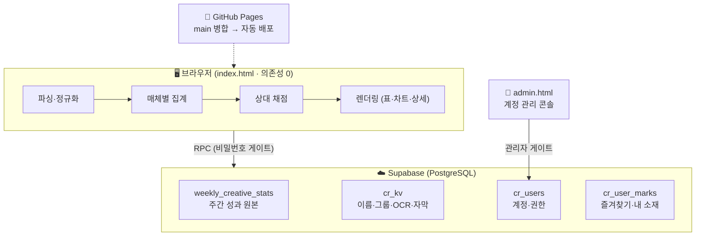
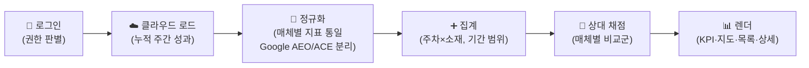
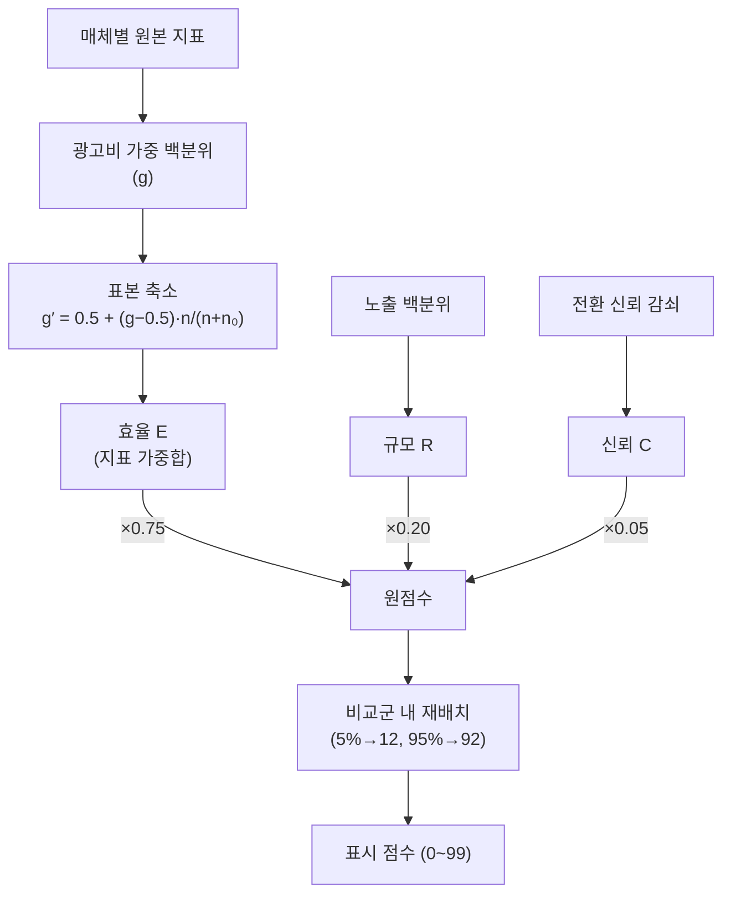

# 당근 소재분석툴 — 발표 콘텐츠 구성 문서

> 이 문서는 **발표자료(슬라이드)를 만들기 위한 마스터 콘텐츠**입니다.
> 현재 운영 중인 「당근 소재분석툴」의 구조·기능·기술을 슬라이드 단위로 정리했습니다.
> 각 슬라이드는 `핵심 메시지(두괄식) → 요점(개조식) → 시각화 지시 → 심화` 순서로 구성됩니다.

---

## 문서 사용법 (제작자용)

- **본문(Part 1)** = 슬라이드 19장. 마케터·디자이너가 이해 가능한 수준으로 서술.
- **`🔧 심화` 블록** = 기술 청중용 상세. 슬라이드 본문에서는 빼고, 필요 시 부록/발표자 노트로.
- **`📊 시각화` 블록** = 그 슬라이드에 들어갈 도식·차트 지시. 실제 그래프는 슬라이드 덱에서 렌더.
- **기술 부록(Part 2)** = 채점 공식·데이터 모델·보안 등 원문 스펙. Q&A·심화 세션 대비.
- 작성 원칙: **두괄식 · 개조식 · 두루뭉술 금지**. 과거 방식·도입 이력은 다루지 않고 **현재 상태**만 서술.

---

# Part 0. 발표 설계

## 한 줄 정의

> **여러 광고 매체에 흩어진 소재 성과를, 한 화면에서 누적·정규화하고, 매체별 상대 채점으로 자동 평가·비교하는 웹 대시보드.**

## 청중 · 목적 · 톤

| 항목 | 내용 |
|---|---|
| **청중** | 마케터 · 디자이너 (경력 보유, 기술/구조 용어 이해도는 낮음) |
| **목적** | 이 툴이 **무엇을 하고, 어떻게 설계됐는지** 소개 → 신뢰·이해 확보 (기능·구조 쇼케이스) |
| **톤** | 전문적 · 간결. 유치한 비유 금지, 장난기 없음 |
| **깊이 전략** | 본문은 개념·도식 중심, 심층 기술은 `🔧 심화`로 분리해 원하는 사람만 |

## 슬라이드 맵 (전체 흐름)

```mermaid
flowchart LR
    A["1. 표지"] --> B["2. 한 장 요약"]
    B --> C["3. 왜 필요한가"]
    C --> D["4. 전체 아키텍처"]
    D --> E["5. 데이터 흐름"]
    E --> F["6. 지원 매체"]
    F --> G["7. 데이터 구조"]
    G --> H["8. 화면 구조"]
    H --> I["9. 분석 탭"]
    I --> J["10. 전체 목록"]
    J --> K["11. 소재 상세"]
    K --> L["12. 채점 시스템 ★"]
    L --> M["13. AB 테스트"]
    M --> N["14. 이름 시스템"]
    N --> O["15. 자료 추출·AI 연계"]
    O --> P["16. 협업 기능"]
    P --> Q["17. 계정·권한·보안"]
    Q --> R["18. 운영·배포"]
    R --> S["19. 마무리"]
```



- **도입부(1–3)**: 무엇을·왜.
- **구조부(4–8)**: 아키텍처·데이터·화면 골격.
- **기능부(9–16)**: 실제 화면과 핵심 기능. **12번 채점이 최대 차별점**.
- **기반부(17–19)**: 계정·보안·운영으로 신뢰 마무리.

---

# Part 1. 슬라이드별 콘텐츠

## 슬라이드 1 — 표지

**핵심 메시지**: 당근 소재분석툴 — 퍼포먼스 광고 소재 성과분석 대시보드.

- **제품명**: 당근 소재분석툴 (repo: CreativeReporter)
- **한 줄 부제**: "매체를 넘나드는 소재 성과, 하나의 기준으로 본다"
- **접속**: 웹 브라우저 · 비밀번호 로그인

📊 **시각화**: 실제 대시보드 스크린샷 1장(전체 목록 또는 효율 지도) + 제품명 오버레이. 당근 브랜드 컬러(주황) 악센트.

---

## 슬라이드 2 — 한 장 요약 (What)

**핵심 메시지**: 서로 다른 매체의 주간 소재 성과를 한 곳에 모아, 같은 잣대로 점수 매기고 비교하는 도구다.

- **입력**: Meta · Moloco · Google의 **주간** 소재 성과 데이터
- **처리**: 매체별로 지표를 정규화 → **광고비 가중 상대 채점** → 등급·순위 자동 부여
- **출력**: 소재별 점수·추세·포지셔닝, 효율 지도, AB 비교, AI용 요약 리포트
- **형태**: 로그인형 웹 대시보드. 계정·권한으로 팀 단위 운영
- **특징**: 외부 라이브러리 0개, 모든 계산을 브라우저에서 수행하는 경량 단일 페이지

📊 **시각화**: `입력(3매체) → [소재분석툴] → 출력(점수·차트·리포트)` 3단 블록 다이어그램. 아이콘으로 매체 3종 표시.

---

## 슬라이드 3 — 왜 필요한가 (문제 정의)

**핵심 메시지**: 매체마다 지표·기준·이름 체계가 달라, "어느 소재가 잘했나"를 한눈에 판단할 수 없었다. 이 툴은 그 판단을 자동화한다.

- **문제 1 — 파편화**: Meta·Moloco·Google이 각자 다른 지표·포맷으로 성과를 보고 → 비교 불가
- **문제 2 — 기준 부재**: 절대 수치(CTR 3%가 좋은가?)만으로는 우열 판단 어려움 → **상대 기준** 필요
- **문제 3 — 식별 난해**: 소재 이름이 URL·ID로만 남아 사람이 못 알아봄
- **해결**: 한 저장소에 누적 → 매체별 **상대 채점** → 사람이 읽는 이름으로 표시 → 한 화면에서 비교

📊 **시각화**: 좌측 "흩어진 3개 리포트(제각각)" → 우측 "하나의 정렬된 표(점수순)"로 수렴하는 Before/After 대비 도식.

🔧 **심화**: 매체별 지표 스키마 규모 — Meta ~14종, Moloco ~20종, Google ~15종. 지표는 계속 추가됨.

---

## 슬라이드 4 — 전체 아키텍처

**핵심 메시지**: 화면(브라우저)·저장소(Supabase)·배포(GitHub Pages) 3개 층으로 이뤄진, 프레임워크 없는 단순·견고한 구조다.

- **프론트엔드**: `index.html` 단일 파일. 바닐라 JS/CSS/SVG, 의존성 0. **집계·채점·차트를 전부 브라우저에서 계산**
- **백엔드**: Supabase(PostgreSQL). 클라이언트는 **RPC(원격 함수)만 호출**, 테이블 직접 접근은 차단
- **호스팅**: GitHub Pages. `main` 브랜치 병합 시 자동 배포
- **관리 콘솔**: `admin.html` 별도 페이지 — 계정 승인·권한 관리
- **설계 철학**: 무거운 프레임워크 대신 **최소 구성**으로 유지보수성·이식성 확보

📊 **시각화** (아래 다이어그램을 슬라이드용으로 렌더):



🔧 **심화**: 모든 테이블은 RLS(행 수준 보안) deny-all. 데이터 접근은 `SECURITY DEFINER` RPC를 통해서만 가능. → 슬라이드 17에서 상술.

---

## 슬라이드 5 — 데이터 흐름 (로그인 → 대시보드)

**핵심 메시지**: 비밀번호로 로그인하면 클라우드에 쌓인 주간 성과가 자동으로 불려와, 매체별 집계·채점을 거쳐 대시보드로 그려진다.

- **1단계 로그인**: 첫 화면에서 비밀번호 입력 → 권한 판별(뷰어/에디터/관리자)
- **2단계 로드**: 승인 계정이면 Supabase의 누적 주간 성과 전량을 한 번에 로드
- **3단계 정규화**: 매체별 원본 지표를 내부 공통 키로 매핑, **Google은 AEO/ACE로 분리**
- **4단계 집계**: (주차 × 소재) 단위로 합산, 선택한 기간·매체 범위로 재집계
- **5단계 채점**: 매체별 비교군 안에서 상대 점수·등급 산출
- **6단계 렌더**: 요약 KPI, 효율 지도, 목록, 상세를 그려냄

📊 **시각화**:



🔧 **심화**: 로드는 `cr_load` RPC가 전체 기록을 **단일 JSON 배열**로 반환(PostgREST의 1,000행 페이지네이션 제한 우회). 기간 필터는 데이터셋을 복제해 `scope()`로 재집계·재채점.

---

## 슬라이드 6 — 지원 매체와 매체 분리

**핵심 메시지**: Meta·Moloco·Google 3개 매체를 지원하며, Google은 성과 기준이 다른 두 유형으로 자동 분리해 별개 매체처럼 다룬다.

- **Meta**: 이미지·영상 소재, CTR·CPM·완주율 등
- **Moloco**: 크리에이티브 리포트 — 미리보기·타입·해상도·완주율, eCPA 기준
- **Google**: 확장 소재 연결 보고서 — ROAS·전환 중심
- **Google AEO / ACE 분리** (핵심 디테일):
  - **AEO** = 신규·설치 최적화 캠페인 → 단가 라벨 **CPI**(설치당 비용)
  - **ACE** = 리타겟팅·인앱액션 캠페인 → 단가 라벨 **CPA**(액션당 비용)
  - 두 유형은 성과·단가 기준이 달라 **집계·채점을 독립적으로** 수행
- **매체 판별**: 리포트 형식 → 미리보기 URL 도메인 → 파일명 순으로 자동 인식

📊 **시각화**: 매체 3종 카드. Google 카드는 AEO/ACE 두 갈래로 분기되는 트리. 각 카드에 대표 지표·단가 라벨 배지.

🔧 **심화**: AEO/ACE 판별은 각 소재의 캠페인 ID를 이름 매핑(`gmap`)의 캠페인명 토큰(`Google_AEO_…`/`Google_ACE_…`)과 대조. 유형 미상은 `Google`로 유지. 단가는 `비용÷전환수`로 동일하나 라벨만 CPI/CPA로 분기.

---

## 슬라이드 7 — 데이터 구조 (무엇을, 어떻게 저장하나)

**핵심 메시지**: 성과 원본은 매체마다 다른 지표를 유연하게 담는 구조로, 보조 정보(이름·그룹·자막)는 별도 저장소로 분리해 관리한다.

- **주간 성과 원본** (`weekly_creative_stats`):
  - 키: **매체 · 주차(월요일 시작) · 소재명** — 이 조합은 **유일**(재업로드해도 중복 없음)
  - 값: 그 주의 원본 수치 전부를 **유연한 형식(JSONB)** 으로 통째 저장
  - 서명: 누가·언제 올렸는지 자동 기록(감사용)
- **보조 저장소** (`cr_kv`, 목적별 키):
  | 키 | 담는 것 |
  |---|---|
  | `gmap` | ID·URL → 사람이 읽는 **공식 이름** 매핑 |
  | `ginfo` | 광고그룹 메타(캠페인·상태·타겟 CPA·영상 퍼널) |
  | `nameovr` | 관리자가 지정한 **소재 이름 오버라이드** |
  | `svcovr` | 관리자가 지정한 **서비스 분류 오버라이드** |
  | `ocr` | 이미지 소재에서 추출한 광고 카피 |
  | `ytt` | 유튜브 영상 제목 |
- **계정·마크**: 계정(`cr_users`)·즐겨찾기/내 소재(`cr_user_marks`)는 별도 테이블

📊 **시각화**: 4개 테이블 카드(성과·보조·계정·마크). 성과 카드는 "키 3개 + JSONB 값" 구조를 강조.

🔧 **심화 — 왜 JSONB인가**: 매체마다 지표 스키마가 다르고(25종+) 새 지표가 계속 생김. 컬럼으로 쪼개면 대부분 NULL인 25+ 컬럼과 지표 추가 때마다 스키마 변경(DDL)이 필요. 사이트는 행 전체를 읽어 브라우저에서 집계하므로 컬럼 쿼리 이점도 없음 → **"식별·필터 키는 컬럼, 내용물은 JSONB"** 하이브리드. 자주 보는 수치는 generated column으로 노출(콘솔 조회용).

---

## 슬라이드 8 — 화면 구조 개요

**핵심 메시지**: 왼쪽 사이드바(매체·기간·요약)와 오른쪽 본문(3개 탭)으로 나뉘며, 본문에서 분석·목록·AB테스트를 오간다.

- **사이드바(다크)**: 매체 선택 · 기간 선택 · 요약 KPI · 저장소 현황 · 용어/자료 버튼
  - **요약 KPI**: 총 광고비 · 설치 · eCPI · 활성 · eCPA (주간 증감 포함)
  - **기간**: 최근 1달 / 3달 / 전체 / 직접 설정
- **본문 세그먼트 탭 3종**:
  1. **분석** — 요약 타일 + 효율 지도 + 주차별 추세
  2. **전체 목록** — 소재 성과 표(점수·지표·필터)
  3. **AB테스트** — 이름 변형 자동 인식 비교 (해당 소재 없으면 탭 숨김)
- **반응형**: 좁은 화면에서 매체·기간 2분할, 요약 접힘, 미리보기 중심

📊 **시각화**: 실제 화면 레이아웃 와이어프레임 — 좌측 사이드바 + 우측 탭 3개. 각 영역에 라벨 콜아웃.

---

## 슬라이드 9 — 분석 탭: 효율 지도와 추세

**핵심 메시지**: 소재들을 2축 좌표에 흩뿌려 "어디에 몰려 있고 무엇이 이탈값인지" 한눈에 보고, 주차별 흐름을 함께 확인한다.

- **효율 지도** (2축 산점도):
  - 기본 축: 가로 **CTR** · 세로 **단가**(eCPA→eCPI→전환당비용 순)
  - **보기 전환**: 개별 소재 / 포맷 / 사이즈 / 형태 / 지면 / 서비스별 집계
  - **지도 전용 필터**: Live(집행 중) · Video · Image (표 필터와 독립)
  - 점 크기 = 광고비, 겹침은 호버 강조 + 양축 범위 슬라이더로 확대
- **주차별 추세**:
  - 선택 기간 전체의 흐름을 막대+선으로
  - **주 지표 토글**: 광고비 / 노출 / 클릭 / 설치 / 활성유저 중 선택
  - 광고비 선택 시 효율선(단가) 동반 표시
- **요약 타일**: 포맷/사이즈 우위, 주간 흐름 하이라이트

📊 **시각화**: 효율 지도 실제 스크린샷 + 축·필터·점크기 의미를 화살표 주석으로. 우측에 추세 그래프 축소본.

🔧 **심화**: 유형별 집계는 상하 10% 트림 합산으로 이탈값 영향 축소. 값이 2개 이상인 차원만 축으로 노출.

---

## 슬라이드 10 — 전체 목록: 성과 표

**핵심 메시지**: 모든 소재를 점수·핵심 지표로 나열하고, 필터·뱃지·계층 컬럼으로 원하는 소재만 빠르게 좁혀 본다.

- **컬럼 계층**: 대표 컬럼(점수 · 광고비 · eCPI · eCPA · CTR · 완주율 · ROAS)만 기본 노출, 헤더 `+`로 세부(노출·CPM·클릭·CPC 등) 펼침
- **점수 색상**: 십의 자리마다 다른 10단계 색(파랑→초록→…→빨강)으로 우열 즉시 인지
- **기본 필터**: **Live**(최신 집행 주 광고비>0) 소재만 + 무점수 소재 숨김
- **뱃지 3종**:
  - 🟢 **Live** — 최신 집행 주에 광고비가 나간 소재 (전 매체 공통)
  - 🟠 **경고** — 구글 정책 제한(사유는 툴팁)
  - **학습중** — 집행 2주 미만 또는 전환 30건 미만
- **그룹 보기(GroupView)**: 광고그룹 단위로 묶어 집계
- **칩 필터**: 이름 아래 칩(서비스·포맷·사이즈·제작자) 클릭 = 즉시 필터
- **복수선택 드롭다운**: 전체 서비스 · 전체 제작자
- 60행 페이지네이션

📊 **시각화**: 목록 스크린샷 확대 — 점수 색상 그라데이션, 뱃지, 계층 컬럼 `+`를 각각 콜아웃.

---

## 슬라이드 11 — 소재 상세: 3열 구조

**핵심 메시지**: 행을 클릭하면 [미디어 · 그래프 · 비교]가 한 줄 3열로 펼쳐지고, 가운데 그래프는 3개 탭으로 소재를 다각도로 진단한다.

- **좌 — 미디어 프레임**: 실제 소재 미리보기(비율별 3종: 세로/정방/가로) + 원본 링크
- **중 — 그래프 탭 3종**:
  1. **주차별 추이** — 막대(광고비)+선(지표), 매 주 아래 **그 주만으로 재채점한 점수**
  2. **영상 시청** (영상 소재) — 구간별 시청 유지 곡선(25→100%), 최대 이탈 구간 음영 + 완주율/조회율 추이
  3. **포지셔닝** — 두 축 모두 "계정 내 위치(백분위)"인 사분면. **오른쪽·위 = 좋음**으로 방향 통일
- **우 — 비교**: 같은 그룹/시리즈 소재를 나란히 (클릭 시 이동)
- **조작**: 키보드 ←/→로 소재 이동, Esc 닫기, 딥링크(URL 해시) 지원
- **모바일**: 미디어 → 비교 → 그래프 순 1열 스택

📊 **시각화**: 상세 뷰 스크린샷 + 3열 라벨. 그래프 탭 3종의 미니 썸네일을 하단에 배치.

🔧 **심화**: 포지셔닝은 광고비 가중 백분위(wPctRank)로, 방향이 반대인 지표(단가 등)는 `1−백분위`로 보정해 항상 "위·오른쪽이 좋음". 중앙값 십자선에 나쁨(빨강)→좋음(초록) 그라데이션.

---

## 슬라이드 12 — 채점 시스템 ★ (핵심 차별점)

**핵심 메시지**: 절대 수치가 아니라, **같은 매체 안에서 광고비로 가중한 상대 위치**로 소재를 채점한다. 그래서 "이 계정에서 이 소재가 몇 등인가"를 100점 척도로 말할 수 있다.

- **점수 = 효율(75%) + 규모(20%) + 신뢰(5%)** 의 가중 합
  - **효율(E)**: CTR·단가·완주율 등 핵심 지표의 **광고비 가중 백분위**
  - **규모(R)**: 노출 수 백분위 (도달 규모)
  - **신뢰(C)**: 전환이 적을수록 감점 (표본 신뢰)
- **핵심 장치 3가지**:
  1. **광고비 가중** — 돈을 많이 쓴 소재가 기준선을 정함 (실집행 반영)
  2. **표본 축소(shrinkage)** — 전환·클릭·노출이 적은 소재는 점수를 중앙(50)으로 끌어당겨 **과대·과소평가 방지**
  3. **코호트 상대평가** — CTR·완주율 등은 **같은 포맷(영상 vs 이미지)** 끼리만 비교
- **매체별 가중치**: Meta/Moloco는 eCPI·eCPA 중심, Google은 ROAS 중심 (매체 특성 반영)
- **표시 점수**: 비교군 내 위치로 재배치 → **5%→12점, 95%→92점** (한쪽으로 쏠리지 않게)
- **등급**: 매우 좋음 ~ 매우 나쁨 5단계 + **독보적**(압도적 1위)
- **평가 제외**: 광고비 하위(15퍼센타일 미만)·핵심 지표 없는 소재는 점수 `–`

📊 **시각화** (채점 파이프라인):



- **발표 팁**: 청중에게는 위 3개 장치(가중·축소·코호트)만 설명하면 충분. 공식 자체는 부록으로.

🔧 **심화**: 원점수 `= 100 × (0.75·E + 0.20·R + 0.05·C)`. 표본 축소 상수 n₀ = 전환 50·클릭 100·노출 2,000. 비교군 8개 미만이면 분위 앵커가 불안정해 원점수를 그대로 사용. 그룹 집계 행도 동일 스펙으로 별도 채점. → 전체 공식은 부록 A.

---

## 슬라이드 13 — AB 테스트 자동 인식

**핵심 메시지**: 소재 이름의 접미 변형(_A/_B, v1/v2, 01~05, 회차 등)을 자동으로 묶어, 어떤 변형이 이겼는지 표로 보여준다.

- **자동 인식**: 이름 끝의 변형 패턴을 감지해 같은 실험군으로 묶음
  - `_A`/`_B`, `v1`/`v2`, 제로패딩 `01`~`05`, `ep`·`편`·`화` 회차 등
  - 오인 방지 규칙 다수(예: 단순 `_2`는 제외)
- **표시**: 목록에 이름 + 🥇🥈🥉 → 펼치면 **변형 비교표**
- **강조**: 유의미한 차이(5% 스프레드 기준)만 색상 표기 — 최고 초록·최저 빨강
- **대표 미디어**: 최고 점수 변형의 소재를 크게 노출
- **탭 자동 숨김**: 인식된 실험 그룹이 없으면 AB테스트 탭 자체가 안 보임

📊 **시각화**: AB 비교표 스크린샷 — 변형 열, 승자 하이라이트, 🥇 표기. "이름만으로 자동 그룹핑" 화살표.

---

## 슬라이드 14 — 표시 이름 시스템 (ID/URL → 사람 이름)

**핵심 메시지**: 매체가 URL·ID로만 남긴 소재를, 여러 출처를 우선순위로 조합해 사람이 읽는 이름으로 바꿔 보여준다.

- **문제**: 구글 이미지 애셋 등은 이름이 URL·숫자 ID뿐 → 사람이 식별 불가
- **해결 — 이름 우선순위**(위에서부터 우선):
  1. **관리자 수동 이름** (직접 지정한 이름)
  2. **그룹 분절형** (`중고거래·shortform·2601`처럼 토큰 분해 + 서비스 한글화)
  3. **공식 애셋 이름** (이름 매핑으로 채워진 정식명)
  4. **OCR 이름** (이미지 속 광고 카피 추출, `OCR` 마크)
  5. **유튜브 제목** (영상 ID로 자동 조회)
  6. **원문** (그 외)
- **자동 보강**: 유튜브 제목은 로드 직후 전 소재 자동 조회
- **원문 보존**: 저장·정렬 키는 항상 원문 유지(호버 시 원문 툴팁)

📊 **시각화**: `simgad_a83f… (URL)` → `여름 세일 3종 (사람 이름)` 변환 예시. 우선순위 6단 사다리 도식.

🔧 **심화 — 오프라인 이름 보강 배치**(필요 시 재실행):
- **PaddleOCR(한국어)**: 구글 이미지 애셋에서 광고 카피 추출 → `ocr` 키. 박스 좌표 기하 정렬로 문장 순서 보정, 로고 오인 후처리.
- **dHash 이미지 매칭**: 몰로코의 실명 있는 이미지와 구글 이미지의 지각 해시(9×8, 해밍 ≤6)를 대조해 동일 이미지를 찾아 실명 부여.
- 취소는 해당 키 삭제 한 번으로 전체 원복.

---

## 슬라이드 15 — 자료 추출 (AI 연계)

**핵심 메시지**: 원하는 조건의 소재 성과를, AI가 바로 읽고 분석할 수 있는 요약 리포트(Markdown)로 내려받는다.

- **진입**: 사이드바 「내 자료 추출하기」 → 중앙 모달
- **조건 선택**:
  - **제작자** (모두 / 개인)
  - **매체** (모두·몰로코·구글·메타 복수)
  - **기간** (1달 / 3달 / 올해 / 전체 / 직접 설정 — 정확한 시작~종료일)
  - **비교 데이터** (없음 / 요약만 / 전체 표) — 기본 "요약만"
  - **최소 점수** (없음 / 40+ / 50+ / 60+ / 70+)
- **출력**: 매체별로 **재집계·재채점**한 성과를 AI가 읽기 좋은 Markdown으로
  - A(대상 제작자) · B(동일 조건 비교군) 섹션 분리
  - 각 소재는 자기 행에만 지표 → **매체·소재 혼용 방지**
  - 매체 간 점수 직접 비교 금지를 헤더에 명시
- **용도**: LLM에게 붙여 "이번 분기 소재 성과 요약/개선점" 등을 바로 질의

📊 **시각화**: 추출 모달 스크린샷(조건 세그먼트들) → 화살표 → 생성된 Markdown 리포트 예시 + "AI에 붙여넣기" 아이콘.

🔧 **심화**: "요약만" 모드는 비교군 기준선 한 줄 + 지표별 중앙값·25/75 백분위 통계표 + 상위 3개만 담아 토큰 대폭 절감. 최소 점수 필터는 표에서만 제외하되 **요약 통계는 전체 기준 유지 + 제외 개수 명시**로 체리피킹·AI 혼동 방지.

---

## 슬라이드 16 — 협업 기능 (팀 단위 운영)

**핵심 메시지**: 즐겨찾기·내 소재·제작자 태깅으로, 여러 사람이 자기 소재를 표시하고 함께 관리한다.

- **즐겨찾기(★)**: 개인용 비공개 마크
- **내 소재(인장)**: 등록자 이름 공개 — "누가 만든 소재인지" 표시
- **제작자 로스터**: `vin · mia · tank · hansy · marin · jace` 고정 목록에서만 지정(직접 입력 없음)
- **그룹 마크**: 광고그룹 별을 누르면 멤버 전원 일괄 토글, 상태는 멤버에서 파생
- **소재 편집(관리자, 연필 팝오버)**: 소재의 **이름 · 서비스 분류 · 제작자**를 한 곳에서 수정
- **일괄 이름 변경(관리자, `/namechange`)**: 모든 소재명을 한 번에 편집·저장
- **보기 필터**: 전체 / 내 소재 / 즐겨찾기

📊 **시각화**: 목록 행에 붙는 별·인장·제작자 칩 확대 컷 + 연필 팝오버(이름/서비스/제작자 3필드) 스크린샷.

---

## 슬라이드 17 — 계정 · 권한 · 보안

**핵심 메시지**: 비밀번호 로그인과 3단계 권한, 그리고 "데이터는 검증된 함수로만 접근" 원칙으로 안전하게 운영된다.

- **가입·승인 흐름**: 회원가입 신청 → 관리자 승인 → 로그인 가능 (거절도 기록 보존, 재승인 가능)
- **권한 3단계**:
  | 권한 | 할 수 있는 것 |
  |---|---|
  | **뷰어** | 읽기 전용 |
  | **에디터** | 저장·수정 가능 |
  | **관리자** | 에디터 + 소재 이름 변경 등 최상위 |
- **보안 원칙**:
  - 모든 테이블은 **직접 접근 차단**(RLS deny-all)
  - 데이터는 **검증된 원격 함수(RPC)로만** 접근, 함수 첫 줄에서 비밀번호 검사
  - **읽기·쓰기·관리자 게이트 3단 분리**
  - 비밀번호는 해시로 저장, 브라우저에는 탭 단위로만 보관(탭 종료 시 소멸)
- **관리 콘솔(admin.html)**: 가입 승인/거절 · 계정 추가 · 비번 변경 · 권한 지정. 관리자 비밀번호는 **코드에 저장하지 않고 런타임 입력만**

📊 **시각화**: 권한 3단 피라미드(뷰어→에디터→관리자) + "브라우저 → [비밀번호 게이트] → RPC → DB" 관문 도식.

🔧 **심화**: RPC는 `SECURITY DEFINER`로 동작하며 각 함수가 `_cr_check_pw`(읽기)·`_cr_check_editor`(쓰기)·`_cr_check_admin`(관리)를 호출해 게이트. 비밀번호는 sha256 해시(로그인 식별) + pgp_sym 복호화 가능 암호문(관리자 열람용, 키는 서버 함수 본문에만). 클라이언트의 publishable key는 공개 가능 값 — 실질 게이트는 비밀번호. → 전체 RPC 목록은 부록 C.

---

## 슬라이드 18 — 운영 · 배포

**핵심 메시지**: main 브랜치에 병합하면 자동 배포되고, 감사 기록과 무결성 체크로 데이터 품질을 유지한다.

- **배포**: `main` 병합 → GitHub Actions가 GitHub Pages로 자동 배포 (실패 시 백오프 재시도)
- **감사(누가·언제)**: 모든 주간 기록에 업로더·시각, 보조 저장소에 수정자·시각 기록
- **저장소 현황**: 사이드바 ☁️ 줄에 소재 수·주간 기록·주 수·업로더 분포 표시
- **저장 규칙**: **주간** 리포트만 누적, 광고비 ₩1,500 미만·매체 미상은 임시 분석(저장 안 함)
- **무결성 체크 7종**(수시): 중복 · 비월요일 주차 · 최소 광고비 미만 · 잘못된 매체 · 빈 이름/날짜/업로더 — 전부 0이어야 정상

📊 **시각화**: `커밋 → main 병합 → Actions → Pages 배포` 파이프라인 + 무결성 체크 7종 체크리스트 카드.

---

## 슬라이드 19 — 마무리 (요약 · 차별점)

**핵심 메시지**: 매체를 넘나드는 소재 성과를 하나의 상대 기준으로 채점·비교하고, 사람이 읽는 이름과 AI 연계까지 갖춘 경량 대시보드다.

- **한 문장**: "흩어진 소재 성과 → 하나의 점수 → 바로 비교"
- **차별점 4가지**:
  1. **매체 통합** — Meta·Moloco·Google(AEO/ACE)을 한 화면에
  2. **상대 채점** — 광고비 가중·표본 축소·코호트 비교로 공정한 점수
  3. **사람이 읽는 이름** — URL/ID를 OCR·매핑·유튜브 제목으로 해석
  4. **AI 연계** — 조건별 성과를 AI가 읽는 리포트로 추출
- **기술적 특징**: 의존성 0의 단일 페이지 + RLS·RPC 게이트로 안전 + 자동 배포
- **다음**: Q&A / 실사용 데모

📊 **시각화**: 슬라이드 2의 요약 도식 재등장(수미상관) + 차별점 4개 아이콘 그리드.

---

# Part 2. 기술 부록 (심화 · Q&A 대비)

> 마케터·디자이너 본 발표에서는 생략. 기술 질문·심화 세션용 원문 스펙.

## 부록 A. 채점 공식 전문

```
원점수 = 100 × (0.75·E + 0.20·R + 0.05·C)

E = Σ wᵢ·g′ᵢ                     (지표별 가중합)
    g  = 광고비 가중 백분위        (모수: 값 보유 전체 소재, 가중치 max(비용,1))
    g′ = 0.5 + (g − 0.5)·n/(n+n₀)  ← 표본 축소(shrinkage)
         n₀ = 전환류 50 · 클릭 100 · 노출 2,000
    방향: 비용류(-1)는 1−백분위
    CTR·CPM·CPC·완주율·상호작용률류 = 같은 포맷(영상/이미지) 코호트(≥8개) 안에서만 상대평가
R = 노출 수의 단순 백분위
C = min(1, ln(1+전환) / ln(1+30))

가중치(SCORING):
  ad(Meta·Moloco):  eCPI .26 / 활성 eCPA .20 / CTR .16 / 신규 eCPA .12 / CPM .10 / 완주율 .08(영상만) / CPC .08
  google:           ROAS .35 / 전환당 비용 .20 / 전환율 .15 / CTR .15 / CPM .15
  adset:            활성 eCPA .35 / eCPI .25 / CTR .20 / CPM .15 / CPC .05
  cg:               CTR .50 / CPC .30 / CPM .20
  ※ 지표 결측 시 가중치 자동 재정규화. 가용도 10% 미만 지표는 제외.

파생 규칙: 분모가 있으면 성과 0도 유효값 (예: 전환가치 0의 ROAS=0. null로 두면 평가 회피)
eligibility: 광고비 ≥ 15퍼센타일 && 가중 .15 이상 핵심 지표 모두 보유. 미달 시 점수 '–'

표시 점수(적격자 ≥ 8):
  lin(v)  = 12 + (v − q05)/(q95 − q05) × 80          (q05·q95 = 적격 원점수 분위)
  soft(v) = v>92 ? 92+(v−92)·7/((v−92)+7)
          : v<12 ? 12−(12−v)·10/((12−v)+10) : v       (양 끝 점근 압축)
  최종    = round(clamp(soft(lin(v)), 2, 99.4) × 10)/10   (소수점 1자리, 순위 보존)
  적격자 < 8 → 원점수 그대로

등급(tier): 적격자 점수 5분위(매우좋음~매우나쁨) + '독보적'(1위가 2위와 압도적 격차 && 비용 ≥ 중앙값)
학습중 배지: 비용>0 && (집행 주 <2 || 전환 <30)
그룹 집계 행도 동일 스펙으로 채점(scoreGroupAgg)
```

## 부록 B. 데이터 모델 상세

### weekly_creative_stats (주간 성과 원본)
- PK: `id` / 유일 제약: **UNIQUE(channel, week_start, ad_name)** → 재업로드 중복은 DB에서 무시
- `channel`: Meta / Moloco / Google (그 외·'기타'는 서버가 거부)
- `week_start`: 주 시작일(월요일)
- `ad_name`: 소재 식별자 (구글은 소재 URL)
- `payload` (JSONB): 그 주 원본 수치 전부
- `uploaded_by` / `uploaded_at`: 감사 서명
- generated column: `cost_krw · impressions · clicks · installs · active_users` (콘솔 조회용, 쓰기 불필요)
- **payload 주요 필드**: `비용, 노출 수, 클릭 수, 어트리뷰션 수, 활성 유저 수, 신규+재활성 유저 수, _vcrNum/_vcrDen(완주율 분자/분모), _v25~_v100(영상 구간 재생수), _g_conversions/_g_convValue/_g_allConv(구글 전환), _m_url/_m_ctype/_m_res/_m_group(몰로코 속성), _g_assetStatus/_g_assetType/_g_adGroupId/_g_campaignId(구글 메타)` 등

### cr_kv (보조 저장소)
- 구조: `(k, v jsonb, updated_at, updated_by)`
- 키: `gmap`(이름 매핑) · `ginfo`(광고그룹 정보) · `nameovr`(이름 오버라이드) · `svcovr`(서비스 오버라이드) · `ocr`(카피 추출) · `ytt`(유튜브 제목)
- merge는 최상위 키별 얕은 병합(ID 단위 갱신) + 수정자 기록

### cr_users (계정·승인·권한)
- `daangn_name`(영문 시작 2~24자) · `name_lower`(대소문자 무관 유일, 사칭 방지)
- `pw_hash`(sha256, 전역 유일 — 비번만으로 로그인) · `pw_enc`(pgp_sym 복호화 가능 암호문, 관리자 열람용)
- `status`: 신청함 / 승인됨 / 거절됨
- `role`: viewer / editor / admin

### cr_user_marks (즐겨찾기·내 소재)
- `(user_name, channel, ad_name, kind)` — kind: `fav`(비공개) / `mine`(공개)
- UNIQUE(user_name, channel, ad_name, kind), RLS deny-all — RPC로만
- `cr_marks_load`: 내 소재는 전원 공개(등록자 이름 포함), 즐겨찾기는 본인 것만

## 부록 C. 보안 모델 · RPC 목록

- **3단 게이트**: `_cr_check_pw`(읽기 — 승인 계정 비번) / `_cr_check_editor`(쓰기 — 승인+editor) / `_cr_check_admin`(관리 — 별도 시크릿, 코드 미저장)
- 모든 데이터 RPC는 첫 줄에서 게이트 호출, 실패 시 예외

| 함수 | 역할 |
|---|---|
| `cr_login(pw)` | 비번만으로 사용자 식별 → {found, name, status, role, viewer} |
| `cr_register(name, pw)` | 가입 신청(형식·중복·예약비번 검증) |
| `cr_load(pw)` | 전 기록을 단일 JSONB 배열로 반환 |
| `cr_save(pw, rows, uploader)` | 주간 기록 벌크 저장(채널·이름·최소광고비 가드) |
| `cr_status(pw)` | 소재/주간/주 수 · 업로더 분포 · 최근 업로드 |
| `cr_kv_get / cr_kv_merge` | 보조 저장소 조회 / 얕은 병합 |
| `cr_names_merge / cr_svc_merge` | 이름·서비스 오버라이드 병합 (관리자 게이트) |
| `cr_mark_set / cr_mark_set_many / cr_marks_load` | 즐겨찾기·내 소재 토글/일괄/로드 |
| `cr_admin_list / cr_admin_set / cr_admin_create / cr_admin_setpw` | 계정 목록·상태/권한/이름 변경·추가·비번 변경 (관리자 게이트) |

## 부록 D. 이미지 로딩 복구

- **문제**: 광고차단 DNS가 광고 CDN(googlesyndication·adsmoloco)을 거부하는 환경
- **복구 순서**: 실패 즉시(0ms) wsrv.nl 프록시 → (1.2s) 원본+캐시우회 → (1.2s) 프록시+캐시우회 → 실패 표시
- **학습**: 프록시로 성공하면 그 기기는 재방문 시 처음부터 프록시로 렌더(`crImgProxy` 저장)
- 모든 이미지 태그는 원본 URL을 `data-osrc`에 보존

## 부록 E. 무결성 · 감사

- 저장 가드: 채널 공백/'기타' 거부, 이름 필수, **광고비 ₩1,500 미만 거부**, 중복 무시
- 무결성 체크 7종: 중복 · 비월요일 주차 · ₩1,500 미만 · 잘못된 채널 · 빈 이름 · 빈 날짜 · 빈 업로더 (전부 0이어야 정상)
- 배포 실패 대응: 배포 스텝 3회 재시도(90초 → 5분 백오프)

---

## 부록 F. 발표 진행 가이드 (선택)

- **시간 배분(약 18분 기준)**: 도입 3분 / 구조 4분 / 기능 8분(채점에 2분 집중) / 기반 2분 / Q&A
- **강조 순서**: 채점 시스템(12) > 매체 통합(6) > 자료 추출·AI(15) > 이름 시스템(14)
- **데모 있으면**: 전체 목록에서 점수 정렬 → 상세 포지셔닝 → 자료 추출 순 3분 시연
- **청중 질문 대비**: "점수는 어떻게 나오나"(부록 A) · "데이터는 안전한가"(부록 C) · "이름은 어떻게 알아보나"(14/부록 D)
